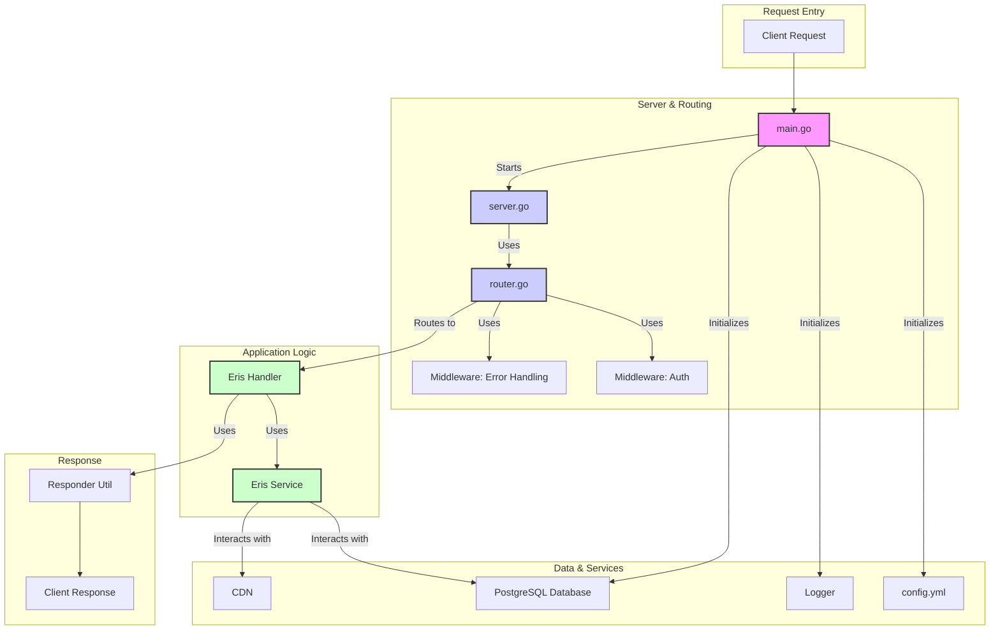

# 🚀 Godin-Next

> A powerful backend service built with Go, featuring a robust API for seamless interaction with backend resources.

[](https://golang.org/)
[](LICENSE)

## ✨ Features

- 🔐 **Secure API** - Robust authentication and error handling middleware.
- 📁 **Modular Design** - Clearly defined separation of concerns between handlers, services, and data layers.
- ⚙️ **Centralized Configuration** - Easy application configuration via a single `config.yml` file.
- 📊 **Structured Logging** - Comprehensive logging with `go.uber.org/zap`.
- 🌐 **RESTful Endpoints** - Clean, RESTful endpoints for all operations.

## 🏗️ Architecture

Godin-Next is composed of loosely-coupled layers that can be scaled or replaced independently. At a high level, control flows from the HTTP surface down to the infrastructure adapters:



## 🚀 Quick Start

### Prerequisites

- Go 1.24 or newer
- PostgreSQL database

### Installation

1. **Clone the repository**
   ```bash
   git clone <repository-url>
   cd Godin-Next
   ```

2. **Install dependencies**
   ```bash
   go mod download
   ```

3. **Set up configuration**
   Create a `config/config.yml` file based on your requirements.

4. **Run the application**
   ```bash
   go run cmd/godin/main.go
   ```

## 📚 API Reference

| Method | Endpoint | Description |
|--------|----------|-------------|
| `POST` | `/...` | Placeholder |
| `GET` | `/...` | Placeholder |
| `DELETE` | `/...` | Placeholder |

## 🔧 Development

### Project Structure

```
Godin-Next/
├── cmd/
│   └── godin/           # Main application entry point
├── config/              # Application configuration
├── internal/
│   ├── api/             # API handlers, router, and middleware
│   ├── cdn/             # CDN service integration
│   ├── config/          # Configuration loading
│   ├── database/        # Database layer (PostgreSQL)
│   ├── logger/          # Structured logging
│   └── server/          # HTTP server setup
└── pkg/
    ├── jsonutil/        # JSON utility functions
    └── responder/       # Standardized API responses
```

### Key Dependencies

- **Configuration**: `github.com/spf13/viper`
- **Logging**: `go.uber.org/zap`

### Running Tests

```bash
# Run all tests
go test ./...

# Run tests with coverage
go test -cover ./...

# Run tests with verbose output
go test -v ./...
```

## 🤝 Contributing

We welcome contributions! Please see our [Contributing Guidelines](CONTRIBUTING.md) for details.

1. Fork the repository
2. Create your feature branch (`git checkout -b feature/amazing-feature`)
3. Commit your changes (`git commit -m 'Add some amazing feature'`)
4. Push to the branch (`git push origin feature/amazing-feature`)
5. Open a Pull Request

## 📝 License

This project is licensed under the MIT License - see the [LICENSE](LICENSE) file for details.

## 🆘 Support

- 🐛 **Issue Tracker** – Create issues for bugs and feature requests.
- 💬 **Discussions** – Join the GitHub Discussions board for questions and ideas.

---

<div align="center">
  <strong>Built with ❤️ and Go</strong>
</div>

<!--
                                                                                                                                                                                                        
                                                                                                                                                                                                        
                                                                                                                                                                                                        
                                                                                                                                                                                                        
                ░██▓      ░▓█▓                                                                                                     ██▓                                                                  
           ▒▓▒  ░██▓       ▓█▒                                ░▓▓░                                                                 ▓█▒                                                                  
          ░███░ ░██▓                                          ▒██▓                                                                                                                                      
          ▓████░░███▓███  ░▓█▓  ▓████░       ▒▓██░  ███████░ ▒████▒ ▒████▓       ▒██████▓  ░███████  ▒███████▓███▓  ░▓████▓        ██▓  ▒████▒       ▒████▓  ░▓██▒  ▓█████▒  ▒██████▒  ▒█████▒          
          ░███  ░███▒▓██▒ ░▓█▓  ███▓▒       ░███░  ▒██▒ ███░  ▒██▒  ▒██▓▒░       ▒██▓▒███░ ▓██▒░▓██  ▒██▓▒▓██▓▒███  ▓██████▓       ██▓  ▓██▓▒        ▒██▓▒   ███▒  ▒██▒ ▓██░ ▒██▒░███░▒███████░         
           ▓██  ░██▓ ▒██▒ ░▓█▓   ░▓██▓      ░███▒  ▒██▒░███░  ▒██▒   ░▒███░      ▒██▒ ▓██░ ▓██▒░▓██░ ▒██▒░▒██▒ ███  ▓██▒▒▒▓░       ██▓   ░▓██▓        ░▒███░ ███▒  ▒██▒ ▓██░ ▒██▒░███░▒███▒▒▓▒          
           ███  ░██▓ ▒██▒ ░▓█▓  █████▒       ░███░  ███▓███░  ░██▒  ▓████▓       ▒██▒ ▓██░ ░▓██████  ▒██▒░▒██▒ ███  ░▓████▓        ██▓  ▓████▒       ▓████▓  ░▓██▒  ▒█████░  ▒██████▒  ▒█████▒          
                                                                                                                                                                             ▒██▒                       
                                                                                                                                                                             ▒██▒                       
                                                                                                                                                                                                        
                                                                                                                                                                                                        
                                                                                                                                                                                                        
                                                                                                  ▓█▓                          ▒█▓▒                                                                     
                                                                                                  ▓██                          ▒██▒                                              ▒▒▓                    
                                                                                                                               ▒██▒                                              ███░                   
                     ▓██▒ ░▓██▓█░  ▒████▓   ░▓████▒  ░██████▒            ░███▓███   ▓████▓        ███  ▓██▓███▒▓██▓░ ░███▓██▓  ▒██▒  ▒████▓   ███▓███▒▓██▓   ▒████▓░  ▓██▓▓██▒  ▓████░                  
                    ▓██▒  ░▓██▓░  ▓██████▓  ███████▒ ░██▓░▓██▒           ▓██▒░███  ▒██▒ ███       ███  ▓██▓▒███▒███▒ ░██▓░▓██▒ ▒██▒ ▓██████▓  ███▓▓███▓▓██▒ ▒███████░ ▓██▓▓██▓   ███░                   
                    ███▒  ░██▓    ▓██▓▒▓▓▒ ░███▒▓▓▓░ ░██▓ ▓██▒  ░░       ▓██░░███  ▓██░ ███       ███  ▓██░░██▓ ▓██░ ░██▓░▒██▒ ▒██▒ ▓██▓▒▓▓▒  ███ ▒██▒░▒██▒ ▓██▓▒▓▓▒  ▓██░░▓█▓   ▓██                    
                    ░███▒ ░▓█▓    ░█████▓░  ▓█████▓  ░██████▓░ ▒██░      ░███████  ░▓█████░       ███  ▓██░░██▓ ▓██▒ ░███████░ ▒██▒ ░█████▓░  ███ ░██▒░▒██▒  ██████▒  ▓██░░▓█▓   ▓██                    
                            ░                        ░██▓     ░██▒       ░▒▓▒▒██▓                  ░    ░   ░     ░   ██▓                      ░    ░                  ░    ░     ░░                    
                                                     ░██▓     ░█▓        ░██████░                                    ░██▓                                                                               
                                                                                                                                                                                                        
                                                                                                                                                                                                        
                                                                                                                                                                                                        
                                           ██▓                          ▒██▒       ▓█▓                 ▓█▓░                            ▒█▒                                                              
                                           ███                          ▒██▒      ░▓█▓                 ▓██░                           ░███                                                              
                                           ███                          ▒██▒      ░▓█▓                 ▓██░                             ░                                                               
                                           ███   ▓███▓▒   ▒██▓▓██░  ▓██▓▓██▒      ░▓██▓██▓   ▒██▓▓██▓  ▓██░ ░▓██▓██▒  ▒██▓▓██▒   ▒██▒  ▓█▓  ▓██▒██▓░  ░▓██▓██▒                                          
                                           ███ ░▓█▓▒▒██▒ ▒██▓▒▓██░ ▒██▓▒▓██▒      ░▓██▒▓██▓ ░▓█▓▒▒██▓  ▓██░ ▓██░▓██▓  ▓███▓███  ▒██▓░  ▓█▓  ▓██▓▓██▒  ▓██▒▒██▓                                          
                                           ███ ▒██▓ ░██▓ ▓██▒ ▓██░ ▒██▒░▒██▒      ░▓█▓░░██▓ ▒██▓░░██▓  ▓██░░███ ░██▓  ▒██▒ ███  ▓██▒   ██▓  ▓██░░██▓ ░██▓░░██▓                                          
                                           ███  ▒██████░ ░███████░ ░▓██████▒      ░▓██████▒  ▓██████▓  ▓██░ ▓██████▓  ▓██░ ███  ░███▓  ▓█▓  ▓██ ░██▓  ▒██████▓                                          
                                           ░░░    ░░░      ░░ ░░░    ░░ ░░░        ░░░ ░░     ░░  ░░░  ░░░   ░░  ░░░   ░░  ░░░    ░░░  ░░░  ░░░  ░░   ░▓▓▒▒██▓                                          
                                                                                                                                                      ▒██████░                                          
                                                                                                                                                        ░░░                                             
                                                                                                                                                                                                        
                                                                                                                                                                                                        
                                                                                                                                                                                                        
                                                                                                                                                                                                        
░░░░░░░░░░░░░░░░░░░░░░░░░░░░░░░░░░░░░░░░░░░░░░░░░░░░░░░░░░░░░░░░░░░░░░░░░░░░░░░░░░░░░░░░░░░░░░░░░░░░░░░░░░░░░░░░░░░░░░░░░░░░░░░░░░░░░░░░░░░░░░░░░░░░░░░░░░░░░░░░░░░░░░░░░░░░░░░░░░░░░░░░░░░░░░░░░░░░░░░░
░░░░░░░░░░░░░░░░░░░░░░░░░░░░░░░░░░░░░░░░░░░░░░░░░░░░░░░░░░░░░░░░░░░░░░░░░░░░░░░░░░░░░░░░░░░░░░░░░░░░░░░░░░░░░░░░░░░░░░░░░░░░░░░░░░░░░░░░░░░░░░░░░░░░░░░░░░░░░░░░░░░░░░░░░░░░░░░░░░░░░░░░░░░░░░░░░░░░░░░░
░░░░░░░░░░░░░░░░░░░░░░░░░░░░░░░░░░░░░░░░░░░░░░░░░░░░░░░░░░░░░░░░░░░░░░░░░░░░░░░░░░░░░░░░░░░░░░░░░░░░░░░░░░░░░░░░░░░░░░░░░░░░░░░░░░░░░░░░░░░░░░░░░░░░░░░░░░░░░░░░░ ░░ ░░ ░░ ░░ ░░ ░░ ░░ ░░ ░░ ░░ ░░ ░░ ░░
░░░░░░░░░░░░░░░░░░░░░░░░░░░░░░░░░░░░░░░░░░░░░░░░░░░░░░░░░░░░░░░░░░░░░░░░░░░░░░░░░░░░░░░░░░░░░░░░░░░░░░░░░░░░░░░░░░░░░░░░░░░░░░░░░░░░░░░░░░░░░░░░░░░░░░░░░░░░░░░░░░░░░░░░░░░░░░░░░░░░░░░░░░░░░░░░░░░░░░░░
░░░░░░░░░░░░░░░░░░░░░░░░░░░░░░░░░░░░░░░░░░░░░░░░░░░░░░░░░░░░░░░░░░░░░░░░░░░░░░░░░░░░░░░░░░░░░░░░░░░░░░░░░░░░░░░░░░░░░░░░░░░░░░░░░░░░░░░░░░░░░░░░░░░░░░░░░░░░░░░░░░░░░░░░░░░░░░░░░░░░ ░░ ░ ░ ░ ░ ░ ░ ░ ░ 
░░░░░░░░░░░░░░░░░░░░░░░░░░░░░░░░░░░░░░░░░░░░░░░░░░░░░░░░░░░░░░░░░░░░░░░░░░░░░░░░░░░░░░░░░░░░░░░░░░░░░░░░░░░░░░░░░░░░░░░░░░░░░░░░░░░░░░░░░░░░░░░░░░░░░░░░░░░░░░░░░ ░░ ░░ ░░ ░░ ░░ ░ ░░ ░ ░ ░ ░ ░ ░ ░ ░ ░░
░░░░░░░░░░░░░░░░░░░░░░░░░░░░░░░░░░░░░░░░░░░░░░░░░░░░░░░░░░░░░░░░░░░░░░░░░░░░░░░░░░░░░░░░░░░░░░░░░░░░░░░░░░░░░░░░░░░░░░░░░░░░░░░░░░░░░░░░░░░░░░░░░░░░░░░ ░░░░░░░░░░░░░░░░░░░░ ░ ░░░░ ░░░░░░░░░░░░░░░░░░ ░
░░░░░░░░░░░░░░░░░░░░░░░░░░░░░░░░░░░░░░░░░░░░░░░░░░░░░░░░░░░░░░░░░░░░░░░░░░░░░░░░░░░░░░░░░░░░░░░░░░░░░░░░░░░░░░░░░░░░░░░░░░░░░░░░░░░░░░░░░░░░░░░░░░░░░░░░░░░ ░░ ░░░░ ░░░░ ░ ░░░░ ░ ░░ ░ ░ ░ ░ ░ ░     ░░░
░░░░░░░░░░░░░░░░░░░░░░░░░░░░░░░░░░░░░░░░░░░░░░░░░░░░░░░░░░░░░░░░░░░░░░░░░░░░░░░░░░░░░░░░░░░░░░░░░░░░░░░░░░░░░░░░░░░░░░░░░░░░░░░░░░░░░░░░░░░░░░░░░░░░░░░░░░░░░░░░░ ░░ ░░░░░░ ░ ░░  ░ ░ ░ ░ ░ ░ ░ ░ ░░ ░ ░
░░░░░░░░░░░░░░░░░░░░░░░░░░░░░░░░░░░░░░░░░░░░░░░░░░░░░░░░░░░░░░░░░░░░░░░░░░░░░░░░░░░░░░░░░░░░░░░░░░░░░░░░░░░░░░░░░░░░░░░░░░░░░░░░░░░░░░ ░░ ░░ ░░ ░░ ░░ ░░ ░░ ░ ░ ░░ ░░ ░ ░ ░░ ░  ░  ░ ░ ░         ░  ░ ░ 
░░░░░░░░░░░░░░░░░░░░░░░░░░░░░░░░░░░░░░░░░░░░░░░░░░░░░░░░░░░░░░░░░░░░░░░░░░░░░░░░░░░░░░░░░░░░░░░░░░░░░░░░░░░░░░░░░░░░░░░░░░░░ ░░ ░░ ░░░░░░░░░░░░░░░░░░░░░░░░░░░ ░ ░░ ░░ ░ ░ ░ ░ ░ ░      ░ ░ ░ ░ ░ ░    ░
 ░ ░░░░░░░░░░ ░░░░░░░░░░░░░░░░░░░░░░░░░░░░░░░░░░░░░░░░░░░░░░░░░░░░░░░░░░░░░░░░░░░░░░░░░░░░░░░░░░░░░░░░░░░░░░░░░░░░░░░░░░░░░░░░░░░░░░░░░░░░░░░░░░░░░ ░ ░ ░ ░ ░ ░░░ ░░ ░░░░ ░ ░     ░ ░ ░  ░ ░ ░ ░   ░ ░ ░
░░░░░ ░░ ░░ ░░░░ ░░ ░░░░░░░░░░░░░░░░░░░░░░░░░░░░░░░░░░░░░░░░░░░░░░░░░░░░░░░░░░░░░░░░░░░░░░░░░░░░░░░░░░░░░░░░░░░░░░░░░░░░░░░░░░░░░░░░ ░░ ░░ ░░ ░░ ░░░░░░░░░░░ ░ ░ ░ ░░ ░ ░░ ░ ░ ░ ░ ░ ░ ░        ░ ░ ░ ░░
 ░░░░░░░░░░░░░░░░░░░░░ ░░ ░░ ░░░░░░░░░░░░░░░░░░░░░░░░░░░░░░░░░░░░░░░░░░░░░░░░░░░░░░░░░░░░░░░░░░░░░░░░░░░ ░░ ░░ ░░ ░░ ░░ ░░ ░░ ░░ ░░░░░░░░░░░░░░░░░░░░ ░ ░ ░ ░░░░ ░░ ░ ░░ ░ ░  ░ ░       ░ ░ ░ ░  ░  ░░░░
░░░ ░░░░░░░░░░ ░░░░░░░░░░░░░░░░ ░░░░░░░░░░░░░░░░░░░░░░░░░░░░░░░░░░░░░░░░░░░░░░░░░░░░░░░░░░░░░░░▒░░░░░░░░░░░░░░░░░░░░░░░░░░░ ░░ ░░ ░ ░ ░ ░ ░ ░ ░░░░ ░░ ░ ░ ░░ ░ ░ ░ ░ ░ ░  ░ ░    ░ ░ ░ ░ ░ ░ ░ ░  ░  ░░░
 ░░░░░ ░░ ░░ ░░░░ ░░ ░░░░░░░░░░░░░ ░░ ░░░░░░░░░░░░░░░░░░░░░░░░░░░░░░░░░░░░░░░░░░░ ░░ ░░ ░ ░░░░▒▒▒▒░░░░ ░░░░░░░░░░░░░░░░░░ ░░ ░░ ░░ ░ ░░░░░░░░░░░ ░░ ░░░░░░ ░░ ░ ░  ░  ░ ░    ░ ░  ░ ░ ░         ░ ░ ░░░░
░░░░░░░░░░░░░░░░░░░░░░░ ░░ ░░ ░░░░░░░░░░ ░░░░░░░░░░░░░░░░░░░░░░░░░░░░░░░░░░░ ░░ ░░░░░░░░░░░░░▒▒▒▓▒▒░░░░░ ░ ░░ ░░ ░░ ░░ ░░░ ░░ ░░ ░░░░ ░░ ░ ░░ ░░░ ░░ ░ ░ ░░ ░ ░  ░  ░  ░ ░ ░  ░ ░      ░ ░ ░ ░ ░  ░ ░░░░
░░░ ░░░░░░░░░░░ ░░░░░░░░░░░░░░░░ ░░░░░░░░░░ ░░░░░░░░░░░░░░░░░░░░░ ░░ ░░ ░░ ░░░░░░░ ░ ░ ░ ░░▒▒▒▓▒▒▓▒▓▒░░░░░░ ░ ░░░ ░░ ░░ ░ ░ ░░ ░░ ░ ░░ ░░ ░░░ ░ ░░ ░░ ░ ░ ░ ░ ░ ░ ░  ░  ░ ░ ░    ░ ░ ░  ░ ░ ░ ░ ░ ░░░░░▒
 ░ ░ ░░ ░░ ░░ ░░░░ ░░ ░░░░░░░░░░░░░ ░░ ░░░░░░░ ░░ ░░ ░░ ░░ ░░ ░░░░░░░░░░░░░░ ░ ░ ░ ░░░░ ░░░▒▓▓▒▓▒▒▒▓▓▒░░░ ░░ ░ ░ ░ ░░ ░░ ░░░ ░░ ░░ ░ ░░ ░░ ░ ░░░ ░░ ░░░░ ░ ░       ░  ░      ░ ░  ░ ░ ░          ░ ░░░░░
░░░░░ ░░ ░░ ░░ ░ ░░░░░░░ ░░ ░░ ░░░░░░░░░░ ░░░░░░░░░░░░░░░░░░░░░ ░░░░░░ ░ ░ ░░ ░   ░  ░ ░░░▒▓▓▓▓▒▒▒▒▒▒▒▒░░░ ░ ░░░░░░ ░░ ░░ ░ ░ ░░ ░░░░ ░░ ░░ ░ ░ ░ ░░ ░  ░ ░ ░ ░ ░ ░ ░  ░ ░ ░  ░ ░      ░ ░ ░ ░ ░  ░ ░░░░
 ░ ░ ░ ░░ ░░ ░░ ░ ░░░░░░░░░░░░░░░░░░░░░░░░░░ ░░░░░░ ░  ░       ░     ░ ░░░░  ░ ░ ░ ░ ░░ ░░▒▓▓▓▒▒▒▒▒▒▒▒▒▒░░░░ ░ ░  ░░ ░░ ░ ░░░░ ░░ ░ ░░ ░░ ░░░░ ░ ░ ░  ░  ░  ░ ░ ░    ░ ░ ░  ░    ░ ░ ░  ░ ░ ░ ░ ░ ░░░░░░
░ ░ ░░░ ░░ ░░ ░░░░░░ ░░░░░░░░░░░░ ░░░ ░░░░░ ░ ░ ░ ░ ░ ░ ░ ░ ░ ░ ░ ░   ░    ░    ░     ░ ░▒▓▒▓▒▒▒▒▒▒▒▒▒▒▒▒░░░ ░ ░░ ░ ░ ░ ░ ░ ░ ░ ░ ░ ░ ░ ░░ ░ ░░ ░ ░ ░  ░  ░      ░ ░      ░  ░ ░  ░ ░ ░            ░░░░▒
░░░░ ░ ░ ░░ ░░ ░ ░ ░░░░ ░░ ░░ ░░░░░░░░░░ ░░░░░ ░   ░ ░             ░ ░ ░ ░  ░ ░ ░ ░ ░ ░ ░▒▓▓▒▒▒▒▒░░░░▒▒▒▒▒░░░ ░ ░░░ ░░ ░ ░ ░ ░ ░ ░ ░ ░░░ ░░ ░ ░░░ ░ ░ ░ ░  ░ ░ ░  ░ ░ ░ ░  ░ ░  ░      ░ ░ ░ ░ ░ ░ ░░░░░
 ░ ░░ ░░░ ░░ ░░ ░ ░░░░░░░░░░░░░░ ░░ ░░░░░░ ░ ░░ ░ ░   ░ ░ ░ ░ ░ ░ ░ ░     ░  ░ ░ ░ ░ ░ ░░▒▓▒▓▒▒▒▒▒▒▒▒▒▒▒▒▒▒░░ ░  ░ ░ ░ ░ ░ ░ ░   ░ ░░ ░ ░ ░ ░ ░ ░ ░ ░    ░  ░ ░ ░    ░ ░ ░    ░  ░ ░ ░  ░ ░ ░ ░ ░ ░   ░░
░ ░ ░░ ░ ░░░░ ░░░░ ░░ ░░░ ░░ ░░ ░░░░ ░ ░ ░░░░ ░ ░ ░ ░  ░ ░ ░ ░ ░ ░   ░ ░ ░ ░  ░   ░ ░ ░ ░▒▓▓▒▒▒▒▒░░░░░░▒▒▒▒▒░░░░ ░ ░  ░   ░   ░ ░ ░  ░ ░ ░░░░░       ░ ░  ░      ░ ░      ░ ░  ░ ░ ░  ░            ░  ░░
 ░░░ ░ ░░ ░ ░░ ░ ░░ ░░ ░ ░ ░░ ░░ ░ ░ ░ ░ ░  ░ ░░░ ░  ░            ░ ░ ░ ░   ░  ░ ░  ░  ░░▒▒▒▓▓▒▒▒▒░░░░░░▒▒▒▒▒░ ░░ ░ ░  ░ ░ ░ ░     ░ ░░░░░░▒░  ░ ░ ░  ░ ░  ░ ░ ░  ░ ░ ░ ░  ░ ░           ░             ░
 ░ ░░ ░ ░░ ░ ░░░░ ░░ ░░ ░░░ ░░ ░░ ░ ░ ░ ░ ░ ░░ ░ ░ ░░ ░ ░ ░ ░ ░ ░  ░     ░ ░ ░  ░ ░ ░ ░ ░▒▒▓▓▓▓▓▓▓▓▓▒▒▒░▒▒▒▓▒░░░░░░ ░ ░     ░ ░ ░░ ░░░░▒▒▓▒░    ░ ░ ░    ░  ░ ░ ░    ░ ░ ░    ░                       ░░
 ░  ░  ░ ░░░░ ░ ░░ ░░ ░░ ░ ░ ░░ ░░░░ ░ ░ ░░░ ░ ░░░░ ░░ ░ ░ ░ ░ ░ ░  ░ ░ ░     ░     ░  ░░▒▒▒▓▓▓▓▒▒▒▒▒▒▒▒▒▒▒▒▓▒▒░░ ░░░ ░░░░░   ░ ░ ░░░▒▓▓▓▒░          ░ ░  ░      ░ ░      ░ ░                       ░░░░
  ░  ░ ░░  ░ ░ ░  ░ ░░ ░ ░░░░ ░░ ░ ░ ░ ░ ░ ░ ░░ ░ ░░  ░           ░ ░ ░  ░ ░ ░ ░ ░ ░ ░ ░░▒▒▓▒▒▒▒▒░░░░░░░░▒▒▓▓▓▓▒▒░░░░░░░ ░ ░░ ░░░░░▒▓▓█▓▒░      ░ ░ ░ ░ ░  ░ ░ ░  ░ ░ ░ ░  ░                     ░░░░░░░
░  ░     ░    ░ ░  ░   ░ ░  ░ ░ ░ ░░░░░░░ ░ ░ ░ ░░ ░ ░ ░░ ░ ░ ░ ░   ░  ░  ░ ░   ░ ░    ░░▒▒▓▒▒▒▒▒▒▒▒▒░▒▒▒▒▓▓▓▓▓▓▓▒▒▒▒▒▒░░░░░░░░░▒▒▓▓██▓▒░       ░ ░      ░  ░ ░ ░     ░  ░                   ░░░░░░░░░▒▒
     ░ ░  ░ ░    ░  ░ ░   ░  ░ ░ ░ ░  ░ ░ ░░░ ░░ ░░ ░ ░ ░ ░ ░ ░  ░ ░ ░  ░    ░ ░   ░ ░░ ░▓▓▒▒▒▓▒▒▒▒▒▒▒▒▒▒▒▒▓▓▓▓▓▓▓▒▓▒▓▒▒▒▒▒░░░▒▒▒▓▓▓▓▓▒░ ░         ░ ░ ░  ░      ░ ░ ░                      ░░░░░▒▒▒▒▒▒▒
              ░ ░             ░   ░ ░  ░ ░  ░ ░ ░ ░ ░ ░  ░ ░   ░ ░    ░  ░ ░  ░ ░ ░ ░  ░░▓▒▒▒▓▓▓▓▓▓▓▓▒▒▓▒▒░░▒▒░░░▒▒▒▒▓▓▓▒▒▒▒▒░░░░▒▒▒▒▒░░░ ░   ░ ░ ░ ░ ░ ░     ░                            ░░░░▒▒▒▒▒▓▒▓▒
                                                        ░ ░ ░ ░   ░ ░  ░  ░ ░    ░   ░ ░░▓▒▒▒▓▓▓▓▓▓▓▓▓▒▓▓▓▒▒░░░▒▒▒▒▒▒▓▒▓▓▓▒▒▒▒░░░▒▒▒░░░░░░░░ ░  ░                                          ░░░░▒▒▒▒▒▒▓▒▓
                                                                 ░ ░ ░  ░    ░ ░  ░ ░ ░░▒▓▒░░▒▓▓▓▓▒▒▒▒░░░░▒░▒▒▒▓▓▓▓▓▓▓▓▓▓▓▓▒▓▒▒▒▒▒▒▒▒░░░░░░░░░░ ░ ░ ░ ░ ░  ░ ░                               ░░░░░▒▒▒▒▒▒
                                                                      ░  ░ ░  ░ ░  ░ ░ ░▒▓▓▒░▒▓▓▓▓▒▒░░░░░░░▒▒▒▓▒▒▓▓▒▒▒▓▓▓▓▓▓▓▓▓▓▒▒▒▒▒▒░░░░▒░░░ ░ ░ ░ ░                                         ░░░░░░░▒▒
                                                                        ░ ░ ░    ░  ░ ░▒▓▓▓▒▒▓▓▓▓▓▓▒▒▒▒▒▒▒▒▒▒▒▒▒▒▒▒▒▒▒▒▒▒▒▒▒▒▓▓▓▓▒▒░▓▓▒░░▒▒▒▒▒░░░                                                 ░░░░▒▒
                                                                                     ░░▓▓▓▓▓▓▓██▓▓▓▒▒▒▒▒▒▒▒▒▒▒▒▒▒▒▒▒░▒░░░░░▒▒▒▒▓▒▒░░░▓▒░ ░░░░▒▒░░                                                  ░░░▒▒
                                                                                     ░▒▓▓▓▒▒▒▒▓▒▓▒▒▒▒▒▒▒▒▒▒▒▒▒▒▒▒▒▒▒▒▒▒░░▒▒▓▓▓▓▓▓▓▒▒ ░░░░░░ ░░░▒░                                                 ░░░░▒▒
                                                                                    ░░▓▓▓▓▒▒▒▒▒▒▒▒▒▒▒▒▒▒▒▒▒▒▒▒▒▒▒▒▓▓▓▓▓▓▓▒▒▒▓▓▓▓███▓▒░  ░░░░  ░░░                                                  ░░░░░
                                                                                     ▒▓██▓▓▓▓▓▒▒▒▒▓▓▓▓▒▒▒▒▒▒▒▒▒▒▓▓█▓▓▒▒░░░░     ░▒██▓░  ░░░░░░░░░                           ░░░░░░                      
                                                                                    ░▒▓████▓▓▓▓▓▓▓▓▓▓▓▓▒▓▓▓▓▓█████▓▒▒▒▒▒░░▒░     ░▒██▓░    ░ ░ ░░░░░░░                      ░░░▒░░░                     
                                                                                   ░▒▓▓█████▓▓▓▓▓▓▓▓▓▓▓▓▓▓▓██████▓▓▒▒▒▒▒▓▒▒▓▒░░   ▒▓█▓▒         ░░░░                       ░░░▒▒░░░░░░░                 
                                                                                   ░▒▓▓▓██▓████████▓▓▓▓▓▓███▓▓▓▓▒▒▒▒▒▒▒▒▒▒▒▒▒▒▒▒░░▒▒▓▓▒▒░                                  ░░░░▒▒▒▒▒▒░░░                
                                                                                   ░▒▓▓███████████████████▓▓▒░░▒▒░░░░░▒▒░░░▒▒▒▒▒▒▒▒░░░▒▓▓▓░  ░░░░░░                         ░░░░░▒▒▒▒▒░░░░             ░
                                                                                   ░▒▓████████████▓▓▓▓▓▒▒▒▓▒▒░░▒░▒░▒▒▒▒▒░▒▒▒▒▒▒▒▒▒▓▓▒▒▒▓▓▓▓▒▒▒▒▒░▒░░░                      ░░░░░░░▒▒▒▒▒░░░░░░           
                                                                                   ░▒▓▓███████████▓▓▓▓▓▓▓▒▒▒▒▒▒▒▒▒▓▓██▓▓▓▒▒▒░▒▒▓▓▓▓▓▒▒▒▒▒▒▒▒▒▓▓▓▓▓▓▓▒▒░           ░░░░░░░░   ░░░░░▒▒▒▒▒▒▒▒▒▒░░░         
                                                                                  ░▒▓▓▓████████▓▓▓████▓▓▓▓▓▓▓▓▓▓▓▓▓▓▓▓▓▓▓▓▓▓▓▓▓▓▓▒▒▒▒▒▒▓▒▒▒▒▒▒▒▓▓▓█▓▓▒░           ░░░▒▒▒░░░░  ░░░▒▒▒▒▓▓▓▓▓▒▒▒░░       ░ 
                                                                                  ░▒▓▓█████████▓▓▓▓█████▓▓▒▒▒▒▒▒▒▒▒░░▒▒▒▒▒▓▒▒▒▒▒▒▒░▒▒▒▒▒▒▒▒▒▒▒░░░░▒▓▓░             ░░░░░▒▒▒░░░░░░▒▒▒▓▓▓▓▓▓▒▒░░░░░░░░░░░░
                                                                                  ░▒▓▓▓███████▓▓▓▓█▓▓▓▓▓▓▓▓▒▒░▒▒▒▒▒▒▒▒░░░░▒▒▒▒░░░░▒▒▒▒▒▒▒▒▒▒▒░░░  ░▒░                 ░░░░░░▒▒▒▒▒▒▓▓▓▓▓▓▓▓▓▒▒░░▒▒▒▒░░▒░▒
                                                                                  ░▒▓▓████████▓▓▓▓▓▓▓▓▓▓▓▓▓▓▒▒▒▒▒▒▒▒▒▒▒▒░░░░░░░░ ░░▒▒▒▒▒▒░░░░░░░░░░░                     ░░░░▒▒▒▒▒▒▓▓▓▓▓▓▓▓▓▒▒▒▒▒▒▒▒▒▒▒▒
                                                                                  ░▒▓▓█████████▓▓▓▓▒▒▒▒▓▓▓▓▓▓▒▒▒░░▒▒▒▒▒░   ░░▒▒▒░░░░▒▒░░░░░░░░░░░░▒░                      ░░▒▒▒▒▒▒▒▒▓▓▓▓▓▓▓▓▓▓▒▓▓▓▓▒▓▒▓▒
                                                                                   ▒▓▓▓█▓██▓█▓█▓▓▓▓▓▓▒▒▒▒▒▓▓▓▓▓▓▒▒▒▒░▒▒▒░░   ░░▒▒▒▒▒░░░░░░░░     ░░                      ░░░░▒▒▒▒▒▒▒▒▓▓▓▓▓▓▓▓▒▒▒▒░▒▒▒▓▓▓
                                                                                   ▒▓▓▓▓███████▓▓▓▓▓▓▓▓▒▒▒▒▒▒▒▒▓▓▓▒▒▒▒▒▒▒░░░░░░░░░░░░░░░                                  ░░░░▒░░░░░▒▒▒▒▒▒▒▒▒▒▒░░░░░░░▒▒
                                                                                   ▒▓█████████▓▓▓▓▓▓▓▒▒▒▒▒▒▒▒▒▒▒░▒▒▓▒▒░▒▒▒▒▒░░░░░                                           ░░░▒░░░░░░░░▒░▒░▒░▒▒▒▒░░▒░▒▒
                                                                                   ▒▓████▓██▓▓▓▓▓▓▓▓▒▒▒▒▒▓▒▒▒▒▒░░░░░░▒▒▒▒░░░░░░░░░░                                         ░░░░░░░░░░░░░░░▒▒▒▒▒▒▒▒▒▒▒▒▒
                                                                                  ░▒██████▓█▓▓▓▓▒▒▒▒▒▒▒▒▒▒▒▒▒▒░░░░░░░░░░░░░░░░░░░░ ░                                         ░ ░  ░░░░░░░▒▒▒▒▓▓▓▓▓▒▒▒▒▓▓
                                                                                  ▒▓███████▓█▓▓▓▓▓▓▒▒▒▒▒▒▒▒▒▒▒▒░░▒▒░░░░░░░ ░ ░ ░ ░                                               ░░▒▒▓▒▒▒▒▓▓▓█████▓▓▓▓▓▓
                                                                                 ░▒▓████████▓▓▓▓▓▓▓▓▒▓▒▓▒▒▒░▒▒▒▒░░░░░░░░        ░░     ░                                        ░░▒▒▓▓▓▓█▓▓▓████████████
                                                                                ░▒▓███████▓▓█▓▓▓▓▓▓▓▓▒▒▒▒▒▒▒▒▒▒▒▒░░░░░░░░        ░░░░                                           ░░▒▓▓▓▓▓▓▓▓▓▓▓▓█████████
                                                                               ░▒▓████████▓▓▓▓▓▓▒▒▒▓▒▒▒▒▒▒▒▓▒▒▒▒▒▒░░░░                                                          ░▒▒▓▓▓▓▓▓▒▒▒▓▓▓▓████████
                                                                               ▒▓████████▓▓▓▓▓▓▒▒▒▓▒▒▒▒▒▒▓▓▒▒▒▒▒▒▒▒░░                                                         ░░▒▒▓▓▓▓▓▒▒░░▒▒▒▓▓▓▓▓▓▓▓▓▓
                                                                              ▒▓████████▓▓▓▓▓▓▓▓▒▓▒▒░░░▒▒▒▒▓▒▓▒░░░▒░░░                                                       ░░▒▒▒▒▒▒▒▒░░░░░░░▒▒▒▒▒▒▒▓▓▓
                                                                             ▒▓▓███▓▓▓▓▓▓▓▓▓▓▓▓▓▓▓▓▓▒▒▒▒▒▒▒▒▒▓▓▓▒▒░░░                  ░                                       ░░░░ ░░░░░░ ░░░░░▒░▒░▒▒▒▒
                                                                           ░▒▓▓█▓▓▓▓▓▓▓▒▒▓▓▓▓▓▓▒▒▓▓▓▓▓▓▓▓▒▒▒▓▓▓▓▓▒▒░░░                           ░ ░░                                        ░░░░░▒░░░▒▒
                                                                          ░▒▓█▓▓▓▓█▓▓▒▒▒▓▓▓▓▓▓▓▒▒▒▒▓▓▓▓▓▓▓▓▓▒▒▒▓▓▒▒▒▒░░                        ░░░░░░░░                                     ░ ░░░░░░▒▒▒▒
                                                                        ░▒▓█████████▓▓▓▓▓▓▓▓▓▓▒▒▒▒▒░▒▒▒▒▒▒▒▒░░░░░▒░▒▒▒░                         ░▒▒▒▒░░░                              ░░░░░░░░░░░░▒▒▒▒▓▒
                                                                       ░▓▓██████▓▓▓▓▓▓▓▓▓█▓▓▓▓▓▓▓▓▒▒▒▒▒▒▒░░░░░░░░░░  ░░                        ░░▒▒▒▒▒░░                             ░░░░░░░░░░░░░░▒▒▒▓▒
                                                                    ░▒▓▓██▓▓▓▓▓▓▓▓███████▓▒▒▒▒▓▓▓▓▓▓▓▓▒▒▒▒▒▒▒▒▒░░░░░░                ░░░░░     ░▒▒▓▓▒▒░░░ ░                           ░░▒▒▒░░░░░░░░░▒▒▒▒
                                                                  ░▒▓██▓▓▓▓▓▓▓▓▓▓▓█▓█▓▓▓▓▓▓▓▒▒▒▒▒▓▓█▓▓▓▓▓▓▓▓▒▒▒▒▒▒▒▒░░░░              ░░░░   ░░▒▒▒▓▓▒▒░░░░░░░                         ░░░▒▒░░░░░░░░░░▒▒▒
                                                                ░▒▓███████████████▓▓▓▓▓▓▓▓▓▓▒▒▒▒▒▒▓▓▓▓▓▓▓▓▓▓▓▒▒▒▒▒▒▒▒▒░▒░░░░░░░░░      ░░░  ░░▒▒▒▓▓▓▓▒▒▒▒▒▒▒░░░░                      ░░░░▒▒▒▒░░░░░░░▒▒▒
                                                              ▒▓▓████████████████▓▓▓▓▓▓▓█▓▓▓▓▓▓▒▒▒▒▒▒▒▒▓▓▓▓█▓▓▓▓▒▒▒▒░▒▒▒▒▒▒▒▒▒▒▒▒▒░░   ░░░░░░░▒▒▓▓▓▓▓▓▒▒▒▒▒▒▒▒▒░░                   ░░░░░▒▒▒▒▒▒░░░░░▒▒▒▒
                                                            ░▓▓███████████████████▓▓▒▒▒▒▒▒▓▓▓▓▓▓▓▒▒▒▒░░▒▒▒▒▓▒▓▓█▓▓▓▓▓▒▒▒▓▓▓▓▒▒▒▒▒▒▒▒▒░░░░░░░░░▒▒▓▓▓▓▓▓▒▒▒▒▒▒▓▓▓▒▒░░░░              ░░░░░░▒▒▒▒▒▒▒░░░░░░░▒
                                                          ░▒▓▓████████████████████▓▓▓▒▒░▒▒▒▓▓▓▓▓▓▓▓▓▒▒░░░░░▒▒▒▒▓▓▓▓▓▓▓▓▓▒▒▒▒░░░  ░░▒▒▒▒░▒▒░░░░░▓▓▓▓▓▓▓▒▒▒▒▓▓▓▓▓▓▓▒▒▒▒▒▒░░░░▒▒░░░░ ░░░░░░░░░▒▒▒▒▒▒░░   ░░
    ░ ░ ░ ░                                             ░▒▓▓█████████████████████▓▓▓▓▒▒▒░▒▒▒▓▓▓▓▓█▓▓▓▓▒▒▒▒░░░▒▒▒▒▓▓▓▓▓▒▒▒░░░░░░     ░░▒▒▒▒░   ░▒▓▓▓▓▓▓▓▓▓▒▓▓▓▓▓▓▓▒▒▒▒▒▓▒▓▒▒▒▓▒▒▒░░░░░▒▒▒▒▒▒▒▒▒▒▒▒▒▒░░░░░
░░░░░░░░░░░░░░░░░░░░░░░░░░░░░░░░░░░░░░░   ░  ░░ ░      ░▒▓▓████████████▓▓▓███▓█▓█▓▓▓▒▒▒▒▒░▒▒▒▒▒▒▒▒▓▓▓▓▓▓▒▒▒▒▒░░░░░░▒▒░░░░░░░░░░░░░░░ ░░░░░░   ░▓▓▓▓▓▓▓▓▓▓▓▓▓▓▓▓▓▓▓▓▓▓▓▓▓▓▓▓▓▓▓▒▒▒▒▒▒▒▒▒▒▒▒▒▒▒▓▓▓▓▓▓▒▒▒▒▒
▒░▒▒▒▒▒░▒░▒░▒▒▒▒▒▒░▒░▒░▒▒▒▒▒▒░░░░░░░░░░░░░░░░░░░░░░░░░▒▓▓▓████████████████████▓█▓▓▓▓▓▒▒▒▒▒▒░▒░▒░░▒▒▒▒▓▓▓▓▓▒▒▒▒▒░░░░░░░░░░░░░▒░▒▒▒▒▒░░░░░░     ░▓▓▓▓▓▓▓▓▓▓▓▓▓▓▓▓▓▓▓▓▓▓▓▓▓▓▓▓▓▓▓▓▓▓▒▒▒▒▒▒▒▒▒▒▒▒▒▓▓▓▓▓▓▓▓▓▓
▒▒▒▒▒▒▒▒▒▒▒▒▒▒▒▒▒▒▒▒▒▒▒▒▒▒▒▒▒▒▒▒▒▒▒▒▒▒▒░░░░░░░░░░░░░▒▒▓▓▓█████████▓█████████████▓▓▓▓▒▒▒▒▒▒▒▒▒▒▒░░░▒▒▒▓▓███▓▓▒▓▒▒▒░░▒▒▒▒▒▒▒▒▒░░  ░░▒▒▒▒▒░░░    ▒▓▓▓█▓▓▓▓▒▓▓▓▓▓▓▓▓▓▓▓▓▓▓██▓▓▓▓▓▓▓▓▓▓▓▓▒▒▒▒▒▒▒▒▒▓▓▓▓▓▓▓▓▓▓▓
▒▒▒▒▒▒▒▒▒▒▒▒▒▒▒▒▒▒▒▒▒▒▒▒▒▒▒▒▒▒▒▒▒▒▒▒▒▒▒▒░▒░▒░▒░░▒░▒░▒▓▓▓█████▓█▓█▓▓▓▓▓▓█▓▓▓▓████▓▓▓▓▓▒▒▒▒▒▒▒▒▒▒▒▒░░▒▒▓▓▓███████▓▓▓▒▒▓▓▓▓▓▓▒▒░       ░░▒▒▒▒▒░░░▒▓▓▓▓▓▓▒▒▒▒▓▓▓▓▓▓▓▓▓▓▓▓█████▓▓▓▓▓▓▓▓▓▒▒▒▒▒▒▒▒▒▒▒▒▒▓▓▓▓▓▓▓▓
▒▒▒▒▒░░▒░░░░░░▒▒▒▒▒▒▒▒▒▒▒▒▒▒▒▒▒░▒▒░▒▒▒▒▒▒░▒░▒░▒▒▒░▒▒▓▓██████████████▓▓███████████▓▓▓▓▒▒▒▒▒▒▒▒▒▒▒▒▒░░░░▒▒▓▓▓███████████▓▓▓▒▒░         ░░▒▒▒▒▒▒▒▒▓█▓▓▓▒▒▒▒▓▓▓▓▓▓▓▓▓▓▓▓▓▓█▓█▓▓▓▓▓▓▓▓▓▒▒▒▒▒▒▒▒▒▒▒▒▒▒▒▒▒▒▒▒▓▒
░░░░░░░░░░░░░░░░▒▒▒▒▒▒▒░░░░░░░░▒░▒░░▒░▒░▒░░▒░▒▒▒▒▒▒▒▓█▓██▓▓██▓▓██████████████████▓▓▓▓▒▒▒▒▒▒▒▒▒▒▒▒▒░▒░░░░░▒▒▓▓▓▓▓██▓▓▓▒▒░░░              ░░▒▒▒▒▒▓▓▓▓▓▒▓▓▓▓▓▓▓▓▒▒▒▒▓▓▓▓▓▓▓▓▓▓▓▓▓▓▓▒▓▒▒▒▒▒▒▒▒▒▒▒▒▒▒▒▒▒▒▒▒▒▓
░▒░▒▒▒▒▒▒░░░░░░░░░░░░░░░░░░░░░░░░░▒░▒▒▒▒▒░▒░▒▒▒▒▒▒▒▓█▓█▓▓▒▓▓▓▓▓▓▓▓████▓██████████▓▓▓▒▒▒▒▒▒▒▒▒▒▒▒▒▒▒▒▒░░░░░░░░░▒▒▒▒▒░░░     ░     ░░░░      ░░░▒▓▓▓▓▒▒▒▒▒▓▓▓▓▒▒▒▒▒▓▓▓▓▓▓▓▓▓▓▓▓▓▓▓▓▓▓▓▓▓▒▓▒▒▒▒▒▓▓▓▓▒▒▒▒▒▒▒
░▒▒▒▒▒▒▒▒▒▒▒▒▒▒▒▒░░░░░░░░░░░░░░░▒░▒▒░▒░▒░░░▒░▒▒▒▒▒▓▓██▓▓▓▓▓▓▓▓▓▓▓▓▓▓▓▓▓▓████████▓▓▓▓▒▒▒▒▓▒▒▒▒▒▒▒▒▒▒▒▒▒░░░░   ░░░░░░   ░ ░░░░░░░░░            ░▒▒▓▒▓▒▒▒▒▒▒▒▒▒▒▒▒▒▓▒▓▓▓▓▓▓▓▓███▓▓▓▓▓▓▓▓▓▓▓▓▓▒▓▓▒▓▒▓▒▒▒▒▒▒▒
▒▒▒▒▒▒▒▒▒▒▒▒▒▒▒▒▒▒▒▒▒░░▒░▒░░░░░░▒▒▒▒▒▒▒░░░░░▒░▒▒▒▒▓█████████████▓▓▓███▓█████████▓▓▒▒▒▒▒▒▒▒▒▓▓▓▓▒▒▒▒▒▒▒▒▒░░░░░░░░░░ ░░░░░░░ ░ ░░░             ░▒▒▓▒▓▒▒▒▒▒▒▒▒▒▒▒▒▒▒▓▓▓▓▓▓▓▓▓████▓▓▓▓▓▓▓▓▓▓▒▓▓▒▒▒▒▓▓▓▒▒▒▒▒▒
░░▒░▒▒▒▒▒▒▒▒▒▒▒▒▒▒▒▒▒▒▒▒▒▒▒░░░░░░░▒░▒░░░░░░░░▒▒░▒▒▓▓▓▓█████████████████████████▓▒▒▒▒▒▒▒▒▒▒▒▒▒▒▓▓▒▒▒▒░░░▒▒░░░░░░░░░░░░░░░░                    ░▒▒▓▓▓▒▒▒▒▒▒▒▒▒▒▒▒▒▒▒▒▓▓▓▓▓▓▓▓████▓▓▓▓▓▓▓▓▓▓▓▒▓▓▓▒▒▒▓▒▒▒▒▓▓
░▒░▒░▒▒▒▒▒▒▒▒▒▒▒▒▒▒▒▒▒▒░▒░░░░░░░▒░▒▒░░░░ ░░░░░▒▒▒▒▒▒▒▒▓▓▓████████████████████▓▓▒▒▒▒▒▒▒▒▒▒▒▒▒▒▒▒▒▒▒░░░░▒▒▒▒░░░░░░▒▒░░░░░░ ░                 ░▒▒▒▒▓▒▓▓▒▒▒▒▒▒▒▒▒▒▒▒▒▒▓▒▓▒▓▓▓▓▓▓▓▓▓▓▓▓▓▓▓▓▓▓▓▓▓▒▓▒▓▒▓▓▒▓▓▓▓▓
▒▒▒▒▒▒▒▒▒▒▒░▒▒░▒▒░░▒░▒▒▒▒▒░░░░░░░░░░▒░░░░░░▒▒▒▒▒▓▓▓▓▓▓▒▓▓██▓▓▓█▓▓▓▓█████████▓▓▓▒▒▒▒▒▒▒▒▒▒▒▒▒▒▒▒▒░▒▒▒░▒▒▒▒▒▒░░░░░░▒░░░░░░░            ░    ░░▒▒▓▒▓▓▓▓▒▒▒▒▒▒▒▒▒▒▒▒▒▒▓▓▒▓▓▓▓▓▓▓▓▓▓▓▓▓▓▓▓▓▓▓▓▒▓▓▓▓▒▓▒▓▓▓▓▓▓▓
▒▒▒▒▒▒▒▒▒▒▒▒▒▒▒▒▒▒░▒▒▒░▒░▒░░░░░░░░░░░▒░░░░░▒▒▒▓▓████▓▓▓▓▓▓▓▓▓▓▓█████████▓▓▓▓▓▓▒▒▒▒▒▒▒▒▒▒▒▒▒▒▒▒▒░▒▒▒▒▒▒▒▒░░░░░░░░░░░░░░░░              ░░ ░░▒▒▒▓▓▓▓▓▓▒▒▒▒▒▒▒▒▒▒▓▒▓▓▒▓▓▓▓▓▓▓▓▓▓▓▓▓▓▓▓▓▓▓▓▓▓▓▒▓▒▓▓▓▓▓▓▓▓▓█▓
▒▒▒▒▒▒▒▒▒▒▒▒▒▒▒▒▒▒▒▒▒▒▒▒░▒░░░░░░░░░░▒▒░░▒░▒▒▒▓████████▓▓▓▓███████████████▓▓▓▓▓▒▒▒▒▒▒▒▒▓▓▓▒▓▒▒▒▒▒▒▒▒▒▒▒▒░░░░░░░░░░░░░░░ ░░    ░░         ░░▒▒▒▓▒▓▓▓▓▓▒▒▒▒▒▒▓▒▓▓▓▓▓▓▓▓▓▓▓▓▓▓▓▓▓▓▓▓▓▓▓▓▓▓▓▓▒▓▓▒▓▒▓▒▓▓▓▓▓▓▓█
▒▒▒▒░▒▒▒▒▒▒▒▒▒▒▒▒▒▒▒▒▒▒▒░▒░░░░░░░░░░░▒▒▒░▒▒▒▓██████████████████████████▓██▓▓▓▓▒▒▓▒▒▒▒▒▓▓▓▓▒▒▒▒▒▒▒▒▒▒▒▒▒░▒░▒░░░░░▒▒▒▓▒▒░ ░░   ░░░        ░▒▒▒▓▒▓▓▒▓▒▒▒▒▒▒▓▓▓▓▓▓▓▓▓▓▓▓▓▓▓▓▓▓▓▓▓▓▓▓▓▓▓▓▓▓▓▓▓▒▓▓▓▓▓▓▓▓▓▓▓▓▓▓
░░░░░░░░░░▒▒▒▒▒▒░░░░▒▒▒▒░░▒░▒░▒░░░░░▒░▒▒▒▒▒▓▓███████████████████████████▓█▓▓▓▓▓▓▓▓▒▒▒▓▓▓▓▓▒▒▒▒▒░░░░░▒▒░░▒▒▒░░░░░▒▒▒▓▓▓░░░░░░░░▒░░       ░▒▒▓▒▓▓▓▓▓▓▒▓▓▓▓▓▓▓▓▓▓▓▓▓▓▓▓▓▓▓▓▓▓▓▓▓▓▓▓▓▓▓▓▓▓▓▓▓▓▓▓▒▓▓▓▓▓▓▓▓▓▓█
░░░░░░░░░░░░▒▒▒▒░░░░░░░░░▒░▒░▒░▒░▒░░▒░▒▒▒▒▓▓▓████████████████████████▓█▓▓▓▓▓▓▓▓▓▓▓▒▒▓▓▓▓▓▓▒▒▒▒▒░░▒▒▒▒▒▒▒▒░░▒░░░░░░░▒▓▒░     ░░▒░░░░    ░▒▓▓▓▓▓▓▓▓▓▓▓▓▓▓▓▓▓▓▓▓▓▓▓▓▓▓▓▓▓▓▓▓▓▓▓▓▓▓▓▓▓▓▓▓▓▓▓▓▓▓▓▓▓▓▓▓▓▓▓▓▓▓▓
░░░░░░░░░░░░░▒▒░░░░░░░░░░░▒▒▒▒▒▒░▒░▒░▒▒▒▓▓▓▓▓█████████████████████▓▓▓▓▓▓▓▓▓▓▓▓▓▓▓▓▓▓▓▓▓▓▓▒▒▒▒▒▒▒░▒▒▒▒▒▒▒▒▒░▒▒▒░░░░░░░░░     ░░░░░▒░░ ░░▒▓▓▓▓▓▓▓▓▓▓▓▓▓▓▓▓▓▓▓▓▓▓▓▓▓▓▓▓▓▓▓▓▓█▓▓█▓▓▓▓▓▓▓▓▓▓▓▓▓▓▓▓▓▓▓▓▓▓▓▓▓▓▓
░░░░░░░░░░░░▒░░▒░░░░░░░░░▒▒▒▒▒░▒▒░▒▒▒▒▓▓▓▓▓▓▓▓████████████████████▓▓▓▓▓▓▓▓▓▓▓▓▓▓▓▓▓▓▓▓▓▓▓▓▒▒▒▒▒▒▒▒▒▓▓▓▓▒▒▒▒▒▓▓▒▒░░░ ░░       ░░░░░▒░ ▒▓▓▓█▓█▓▓▓▓▓▓▓▓▓▓▓▓▓▓▓▓▓▓▓▓▓▓▓▓▓▓▓█▓▓█▓▓█▓▓▓▓▓▓▓▓▓▓▓▓▓▓▓▓▓▓▓▓▓▓▓▓▓▓
░░▒░▒░▒░▒░▒░░░░░▒░▒░░░░░▒▒▒▒▒▒▒▒▒▒▒▒▒▓▓▓▓▓▓▓▓▓▓▓▓██████████████▓▓▓▓▓▓▓▓▓▓▓▓▓▓▓▓▓▓▓▓▓▓▓▓▓▒▒▒▒▓▓▓▒▒▒▒▓██▓▒▒░▒▒▓▓▓▒▒░░░░░       ░░░░░░░░▒▓█▓▓█▓█▓█████▓▓▓▓▓▓▓▓▓▓▓▓▓▓▓▓▓▓▓▓▓█▓▓█▓▓▓▓▓▓▓▓▓▓▓▓▓▓▓▓▓▓▓▓▓▓▓▓▓▓▓▓
░▒░▒▒▒▒▒░▒░▒░▒░▒▒▒▒▒░░░░░▒▒▒▒▒▒▒▒▒▒▒▓▓▓▓▓▓▓█▓▓█▓█████████████▓▓▓▒▓▓▓▓▓▓▓▓▓▓▓▓▓▓▓▓▓▓▓▓▓▒▒▒▒▒▓▓▓▓▒▒▒▒▓▓▓▓▒░░░▒▒▓▒▒░ ░░▒░░    ░░░░░░░░▒▒▓▓▓█▓███████████▓▓▓▓▓▓▓▓▓▓▓▓▓▓▓▓▓▓▓▓▓▓▓▓▓▓▓▓▓▓▓▓▓▓▓▓▓▓▓▓▓▓▓▓▓▓▓▓▓▓▓
░▒▒░▒░░▒░░░░░░░░▒░▒░░░░░▒░░▒▒▒▒▒▒▒▒▓▓▓▓▓▓▓██████████████████▓▓▓▓▓▓▓▓▓▓▓▓▓███▓▓▓▓▓▒▓▓▓▒▒▒▓▓▓▓▓▓▒▒▒▒▒▓▓▓▒▒░░░░░▒░    ░░░    ░░░░░░░░▒▓▓████████████████▓█▓▓▓▓▓▓▓▓▓▓▓▓▓▓▓▓▓▓▓▓▓▓▓▓▓▓▓▓▓▓▓▓▓▒▒▓▒▓▓▓▓▓▓▓▓▓▓▓▓
░░▒░▒░▒░░▒▒░░░░░░░░░░░░░░░░▒▒▒▒▒▒▒▒▓▓▓▓▓▓▓▓▓▓███████████████▓▓▓▓▓▓▓▓▓▓▓▓▓▓▓█▓▓▓▓▒▓▓▓▓▓▓▓▓▓▓▓▓▓▓▒▒▒▓▓█▓▓▒░░░░░░                 ░░▒▓███████████████████▓█▓▓▓▓▓▓▓▓▓▓▓▓▓▓▓▓▓▓▓▓▓▓▓▓▓▓▓▓▓▒▓▒▓▒▓▓▒▓▓▓▓▓▓▓▓▓▓▓
░░░░░░░░░░░░░░░░░░░░░░░░░░░░░░░▒▒▓▓▓▓▓▓▓▓▓▓▓█▓█▓█▓██████▓█▓▓▓▓▓▓▓▓█▓▓▓▓▓▓▓▓▓▓▓▓▓▓▓▓▓▓▓▓▓▓▓███▓▓▒▒▒▓▓▓▓▒▒▒░░░░░               ░░░▒▓█████████████████████▓█▓▓▓▓▓▓▓▓▓▓▓▓▓▓▓▓▓▓▓▓▓▓▒▒▓▒▒▓▒▒▒▒▒▒▒▓▒▓▓▓▓▓▓▓▓▓▓
░░░░░░░░░░░░░░ ░░░░    ░     ░░▒▓▓▓▓▓▓▓▓█▓▓█▓█▓███████▓▓▓▓▓▓▓▓▓▓▓▓█▓▓▓▓▓▓▓▓▓▓▓▓▓▓▓▓▓▓▒▒▓▓▓██▓▓▒▒▒▒▒▒▒▒▒▒▒░░░░░            ░░░░▒▒▓▓█████████████████████▓█▓▓▓▓▓▓▓▓▓▓▓▓▓▓▒▒▒▓▓▓▒▒▒▒▒▓▒▓▒▓▓▓▓▓▓▓▓▓▓▓▓▓▓▓▓▓▓
░░░░░░░░░░░░░░░░░░░░    ░░░░░░▒▓▓█▓▓███▓███▓████████▓▓▓▓▓▓▓▓▓▓▓▓▓▓▓▓▓▓▓▓▒▒▓▓▓▓█▓█▓▓▓▒▒▒▒▓▓▓▓▓▒▒▒▒▒░░░▒▓▒▒░ ░░            ░░░░░▒▓▓▓████████████████████▓█▓▓▓▓▓▓▓▓▓▓▓▓▓▒▓▒▒▒▒▒▒▓▒▒▒▒▒▒▓▓▓▓▓▓▓▓▓▓▓▓▓▓▓▓▓▓▒▓
░░░░░░░░░░ ░ ░░░▒░░░░░░ ░░░░▒▒▓█████▓███████▓█████▓▓▓▓▓▓▓▓▓▓▓▓▓▓▓▓▓▓▓▓▓▓▓▓▓▓█████▓▓▓▒▒▒▒▒▓▒▒▒▒▒▒▒░░░░▒▒▓▒░ ░             ░░░░▒▓▓▓▓▓▓████████▓▓█████████▓█▓▓▓▓▓▓▓▓▓▓▓▓▒▓▒▓▒▓▒▒▒▒▒▒▒▒▒▒▓▓▓▓▓▓▓▓▓▓▓▒▒▒▒▒▒▒▒
░░░░░░░░░░░░░░░░░▒▒▒░░░░░░░▒▒▓█████▓▓████▓██████▓▓▓▓█▓███▓█▓▓▓▓▓▓▓▓▓▓▓▓▓▓▓▓██████▓▓▒▒▒▒▒▒▒▒▒▒▓▓▓▓▒ ░░▒▒▒▒░                 ░▒▒▓▓▓▓▓▓▓▓▓▓█▓▓▓▓▓▓▓██████▓▓▓▓▓▓▓▓▓▓▒▒▒▒▓▒▓▒▓▒▒▓▒▒▒▒▒▒▒▒▒▒▒▓▒▓▓▓▓▓▓▓▒▒▒▒▒▒▒▒
░░░▒░▒▒▒░░░░░░░░▒▒▒▒▒░░░░░░▒▒█████████████████▓▓▓▓▓▓▓█▓████▓▓▓▓▓▓▓▓▓▓▓▓▓▓▓▓████▓▓▓▒▒▓▓▒▒▒▒▒▒▒▓▓▓▓░  ░░▒░░░                ▒▒▓▓▓▓▓▓▓▓▓▓▓▓▓▓▓▒▒▓▓▓▓▓███▓█▓▓▓▓▓▓▓▒▒▒▒▒▒▒▒▒▓▒▓▒▒▒▒▒▒▒▒▒▒▒▒▒▒▓▓▓▓▓▓▒▓▒▒▒▒▒▒▒▒
▒░░░░░░▒░░░░░░░▒▒▒▒▒▒░░░░░░░▓████████████████▓▓▓▓▓▓▓▓▓▓▓▓█▓▓▓▓▓▓▓▓▓▓▓▓▓▓▓█▓▓▓▓▓▓▒▒▓▒▓▓▓▒▒░░▒▒▒▓▓▓▒  ░░░░░             ░░░▒▓▓▓▓▓▓▓▓▓▓▓▓▒▒▓▒▒▓▓▓▓▓▓▓▓▓▓▓▓▓▓▓▓▓▓▓▓▒▒▒▒▒▒▒▒▒▒▒▓▒▓▓▒▓▓▓▓▓▓▒▒▓▒▓▓▓▓▒▓▒▒▒▒▒▒▒▒▒
░░░░░░░░░░░░░░░░░▒▒▒░░░░░░░▒▓███████████████▓▓▓▓▓▓▓▓▓▓▓▓▓▓▓▓▓▓▓▓▓▓▓▓▓▓████▓▓▓▓▓▒▒▒▒▒▓▓▓▒░░░░░▒▒▓▓▒   ░░░            ░░░░▒▓▓▓▓▓▓█▓█▓▓▓▓▓▓▓▓▓▓▓▓▓▓█▓█▓█▓▓▓▓▓▓▓▓▓▓▓▒▒▒▓▒▓▒▓▒▓▒▓▒▓▓▓▓▓▓▓▓▒▒▒▓▒▒▒▓▒▒▒▒▒▒▒▒▒▒▒
░░░░░░░░░░░░░░░░░░░░░░░░░▒▓████████████████▓▓▓▓▓▓▓▓▓▓▓▓▓▓▓▓▓▓▓██▓▓▓▓▓████▓▓▓▓▓▒▒░░▒▓▓▓▓▒▒░░░░▒▒▒▒▒░░░░░              ░░▒▓▓▓▓▓▓▓█████▓▓▓▓▓▒▓▓▓▓▓▓▓▓▓█▓▓▓▓▓▓▓▓▓▓▓▓▓▓▓▒▓▒▓▒▒▒▒▓▓▓▓▓▓▓▓▓▓▒▒▒▒▓▒▒▒▒▓▒▒▒▒▒▒▒▒▒
░░░░░░░░░░░░░░░░░░░░  ░▒▓▓████████████████▓▓▓▓▓▓▓▓▓▓▓▓▓▓▓▓▓▓█████▓▓▓███▓▓▓▓▓▒▒▒░░░▒▓▓▓▓▒▒░░░░░▒▒▒░░░                ░▒▓▓▓▓▓▓█▓███████▓▓▓▓▓▓▓▓▓▓▓█▓█▓█▓▓▓▓▓▓▓▓▓▓▓▓▓▓▓▒▓▒▒▒▒▓▒▓▓▓▓▓▓▓▓▒▓▒▒▒▒▒▒▒▒▒▓▒▒▒▒▒▒▒▓
░░░░░░░░░░░░░░░░░░  ░▒▓▓█▓▓▒▓▓███████████▓▓▓▓▓▓▓▓▓█▓▓▓██▓█▓███████▓▓▓▓▓▓▓▓▓▓▒▒░░░▒▒▓▓▓▒▒░░░░░░░░░                  ▒▓███▓▓▓▓▓███████▓▓▓▓▓▓▓▓▓▓▓▓▓█▓▓▓▓▓▓▓▓▓▓▓▓▓▓▓▓▓▓▓▒▒▒▒▓▒▓▓▓▓▓▓▓▓▓▒▓▒▒▒▒▒▒▒▒▒▒▓▓▓▓▓▓▓▓
░ ░ ░ ░ ░ ░   ░░░░▒▒▓▓▓▓▒▒▒▒▒▓█████████▓▓▓▓▓▓▓▓▓▓▓▓▓▓▓██▓███▓██▓█▓▓▓▓▓▓▓▓▓▓▓▒▒░░░▒▒▒▒▒▒░░░░░░░░░░                ░▒▓██████▓▓▓▓████▓▓▓▓▓▓▓▒▒▓▓▓▓▓▓▓▓▓▓▓▓▓▓▓▓▓▓▓▓▓▓▓▓▓▓▒▒▒▒▒▓▓▓▓▓▓▒▓▒▓▓▓▓▓▓▒▓▓▒▓▒▒▒▓▓▓▓▓▓▓
 ░ ░ ░░░░░░    ░▒▒▓▒▒░░▒▓▓▓▒▓▓▓▓▓▓▓▓▓▓▓▓▓▓▓▓▓▓▓▓▓▓▓▓▓▓▓█▓▓▓▓▓▓▓▓▓▓▓▓▒▓▒▓▓▓▓▓▓▒▒░░▒▒▒▒▒▒░ ░░░░░░░              ░░▒▓▓███████▓▓▓▓▓███▓▓▓▓▓▓▒▓▒▓▓▓▓▓▓▓▓▓▓▓▓▓▓▓▓▓▓▓▓▓▓▓▓▒▒▒▒▒▒▒▓▓▓▓▓▓▓▓▓▓▓▓▓▓▓▓▓▓▓▓▓▓▒▒▒▒▓▓▓▓
  ░░ ░ ░░▒▒░░░░▒▒▒░   ░▒▓▓███▓▓▒▒▒▒▒▓▓▓▓▓▓▓▓▓▓▓▓▓▓▓▓▓▓▓▓▓▓▓▓▓▓▓▓▓▒▒▒▒▒▓▓▓▓▓▓▒▒░░░▒▒▒▒▒▒░░ ░░░░░           ░░░░░▒▒▓█████████▓▓▓▓▓▓▓▓▓▓▓▒▒▓▒▓▒▒▓▓▓▓▓▓▓▓▓▓▓█▓█▓▓▓▓▓▓▓▒▒▒▒▒▒▒▒▒▓▓▓▓▓▓▓▓▓▓▓▓▓▓▓▓▓▓▓▓▓▒▒▒▒▒▒▒▓
        ░░░▒▒▒░░ ░░░▒▓▓████▓▓▓▒▒▒▒▒▒▒▒▓▒▓▓▓▓▒▓▓▓▓▓▓▓▓▓▓▓▓▓▓▓▓▓▓▓▓▓▓▒▒▓▓▓▓▓▓▒▒░░░░▒▒▒▒▒░░░░░░ ░       ░  ░ ░░░▒▒▓▓▓▓████████▓▓▓▓▓█▓▓▓▓▓▓▒▒▒▒▓▒▒▓▓▓▓▓▓▓▓█▓▓▓▓█▓▓▓▓▓▒▒▒▒▒▒▒▒▒▒▓▓▓▓▓▓▓▓▓▓▓▓▓▓▓▓▓▓▓▓▓▒▒▒▒▓▒▓▒
          ░▒▒▒░░░▒▒▓▓███▓▓▓▓▒▓▒▒▒▒▒▒▒▓▓▓▓▓▓▒▒▒▓▓▓▓▓▓▓▓▓▓▓▓▓▓▓▓▓▓▓▓▓▒▓▓▓▓▓▒▒▒▒▒░░░░░░░░░░░░░░        ░ ░ ░░░▒▒▒▓▓▓▓▓▓▓█████▓▓▓▓███▓▓▓▓▓▓▓▓▓▒▒▒▒▒▓▓▓▓▓▓▓▓▓█▓▓▓▓▓▓▓▓▓▒▒▒▒▒▒▒▒▒▓▓▓▓▒▓▓▓▓▓▓▓▓▓▓▓▓▓▓▓▓▓▒▓▒▒▒▒▓
      ░░░ ░░▒▒▒▓▓██████▓▓▒▒▒▓▒▓▒▒▒▒▒▓▓▓▓▓▓▓▓▓▒▒▒▒▓▓▓▓▓▓▓▓▓▓▓█▓▓▓▓▓▓▒▒▒▒▒▒▒▒▒▒▒░░░░░░░░░░░░   ░  ░░░░░░░░░▒▒▓▓▓▓▓▓▓▓▓▓▓▓▓▓▓▓▓▓█████▓▓▓▓▓▓▓▓▓▓▒▒▒▒▓▓▓▓▓▓▓▓▓▓▓▓▓▒▓▓▓▓▓▓▓▓▒▓▓▓▓▓▓▒▒▒▓▓▓█▓▓▓▓▓▓▓▓▓▓▓▓▒▒▒▒▒▓▒▒
      ░░░▒▒▒▓▓████████▓▓▓▓▓▒▒▒▒▒▒▒▒▒▒▒▒▒▒▒▒▒▒▒▒▒▓▓▓▓▓▓▓▓▓▓▓▓█▓▓▓▓▓▒▒▒▒░░░░▒▒▒▒░░░░░░░░░░  ░░░░░░░░░░░░░▒▓▓▓▓▓▓▓▓▒▓▓▒▒▒▒▒▒▓▓▓█████▓▓▓▓▓▓▓▓▓▓▒▒▒▒▒▓▓▓▓▓▓▓▓▓▓▓▓▒▒▒▒▓▓▓▓▓▓▓▓▓▓▓▓▒▒▒▓▓▓█▓▓▓▓▓▓▓▓▓▓▓▓▓▒▒▒▒▒▒▒▒
░ ░ ░░░▒▒▓▓████████▓▓▓▓▓▒▒▒▒▒▒░░░░░░░░░░░░░▒▒▒▒▒▒▓▓▓▓▓▓▓▓▓▓▓▓▓▓▓▒▒▒▒░░░░░▒▒▒▒▒░░░░░░░░░░░░░░░░░░░░ ░░▒▓▓▓▓▓▓▓▓▓▓▓▓▓▒▒▒▒▓▒▓▓▓▓▓█▓▓▓▓▓▓▓▓▓▓▓▒▒▒▒▒▓▓▓▓▓▓▓▓▓▓▓▒▒▒▒▒▓▓▓▓█▓▓▓▓▓▓▓▒▒▒▒▓▓▓▓▓▓▓▓▓▓▓▓▓▒▒▒▒▓▓▓▒▓▒▓▒
░ ░░▒▓▓▓████▓▓▓▓▓▒▒▒▒▒▒░░░        ░░░░░░░░░░▒▒▒▒▒▒▒▒▒▒▓▒▓▓▓▓▓▓▒▒▒▒▒░░░▒▒░░░░▒░░░░░  ░░░░░▒░░░░░░    ░▒▒▓▓▓▓▓▓▓▓▓▓▓▓▒▒▒▒▓▓▓▓▓▓▓▓▓▓▓▓▓▓▓▓▓▓▓▒▒▒▒▓▓▓▓▓▓▓▓▓▓▓▒▒▒▒▒▒▓▓▓▓▓█▓█▓▓▓▒▒▒▒▒▓▓▓▓▓▓▓▓▓▓▓▓▓▓▓▓▓▓▓▓▓▓▓▓▓
░░▒▓▓███▓▓▒▒░▒░░░░      ░             ░░░ ░ ░░░░▒▒▒▒▒▒▒▒▓▓▓▒▒▒▒▒▒░░░░░▒▒░░░░░░░░░░░░░▒▒▒▒▒▒░░░         ░░▒▒▒▒▒▒▒▒▓▓▒▒░▒▓▓▓▓▓▓▓▓▓▓▓▓▓▒▒▒▒▒▒▒▒▒▓▓▓▓▓▓▓▓▓▓▒░░░   ░▒▒▓█▓▓▓▓▓▓▓▒▒▒▒▒▒▓▒▓▓▓▓▓▓▓▓▓▓▒▓▓▓▓▓▓▓▓▓▓▓
▓▓▓██▓▒░░     ░░        ░                       ░░░░▒▒▒▒▒▒▒▓▓▒▓▒▒░░  ░░░░░░░░░░░░░░▒▒▒▒▒▒░░░░               ░░░░░▒▒▒▒░░▒▓▓▓▓▓▓▓▓▓▓▒▓▒▒▒▒▒▒▒▒▒▓▓▓▓▓▓▓▒▒░░        ▒▓▓▓▓▓▓▓▓▒▒▒▒▒▒▒▒▓▓▓▓▓▓▓▓▓▓▓▓▓▓▓▓▓▓▓▓▓▓▓
▒▒▒░         ░░░      ░░░░░░░░░░░               ░░░░░░░▒▒▒▒▒▒▒▒▒▒░    ░░░░░  ░   ░░░░▒░░░░░░                ░░░░░░░░░░░▒▒▓▓▓▓█▓▓▓▓▓▒▒▒▒▒▒▒▒▓▒▓▓▓▓▓▒▒░░░         ▒▓▓▓▓▓▓▓▒▒▒▒▒▒▒▓▒▒▓▓▒▓▓▓▓█▓▓▓▓▓▓▓▓▓▓▓▓▓▓
            ░░ ░    ░░░░░░░░░░░░░░            ░░░░░░  ░░░▒▒▒▒▒▒▒░░      ░░░   ░░░░░░░░░░░░░▒░          ░░▒▒▒▒▒░░░░░   ░░░░▒▒▒▓▓▓▓▓▓▒▒▒▒▒▒▓▒▓▓▓▓▒▒▒▒▒░░         ░▒▓▓▓▓▓▒▒▓▒▓▓▓▓▓▓▓▒▒▒▒▒▓▓▓▓▓▓▓▓▓▓▒▓▓▓▓▓▓▓
▒▒▒░░░░░░░░░░░░   ░ ░░░░░░░▒▒▒▒▒▒▒▒░░░░░       ░░░░░░   ░░▒▒▒▒▒░░░      ░░░░░░░░░░░░▒░░░░▒▒▒▒░░░░▒▒░░░░░░░▒▒▓▒▒▒▓▒▒░░░░░░░ ░░░░▒▒▒▒▒░░░░▒▒▒▒▒▒▒▓▒▒▓▓▒░░        ░▒▒▓▓▓▓▓▒▓▒▓▓▓▓▓▓▓▓▒▒▒▒▓▓▓▓▓▒▒▒▒▓▒▒▓▓▓▓▓▒
▒▒▒▒▒▒▒▒▒▒▒▒▒░░░░░░  ░░░▒▒▒▒▒▒▒▒▒▒▒▒▒▒▒░▒▒▒▒▒░░░░░░░░░░ ░░░░░░▒░░░      ░ ░░░░░▒░▒▒▒░░░░░░▒▒▒▒▒░░░▒▒▒▒▒▒░░░░░░▒▒▒▒▒▒▒▒▒▒▒░░░░░░░▒▒░░░░░░░░▒▒▒▒▒▒▒▓▒▓▒░░          ░░░░▒▒▒▒▓▒▓▓▓▓▓▓▓▓▒▓▒▓▓▓▓▓▓▒▓▒▒▓▒▒▒▓▓▒▒
▒▒▒▒▒▒▒▒▒▒▒▒▒▒▒▒▒░▒░░░░░░░░░░░░░░░░░░░░░░░▒▒▒░░  ░░░░░░   ░░░░░▒░░░       ░ ░░░░▒▒▒▒▒░░░░░░▒▒▓▒▒░░ ░░░░░░░░░░░░░░░░░░░░▒▒▒▒▒░░░░░░▒▒░▒░░░░░▒▒▒▒▒▒▒▒▒▒░░░▒░▒▒▒▒░░      ░░▒▒▒▒▒▒▒▒▒▓▓▓▓▓▓▓▓▓▓▓▓▓▒▓▒▒▒▒▒▒▒░
▒▒▒▒▒▒▒▒▒▒▒▒▒▒▒▒▒▒▒▒▒▒▒▒░░░░░░░░░░░░░░░░░░░░░░░░░ ░ ░ ░░░░░░░░░░▒▒▒▒░    ░░░░░░░░░░░░░░░░ ░░░▒▓▒▒░░░░░░░▒░▒░▒▒░░░░░░░░░░░░░░░▒░░░░░▒▒▒░░░░░  ░░░░░░░░░░▒▒▒▒▒▒▒▒░░░░░░░░░░░░▒▒▒▒▒▒▒▓▓▓▓▓▓▓▓▓▓▓▓▒▒▒▒▒░░░░░
▒▒▒▒▓▒▓▒▓▒▒▒▓▒▒▒▓▒▓▒▓▒▒▒▓▒▒░░░░░░░░░░░░░░░░░░░░░░░░░░░░░░░░░░░░░░░▒▒░░    ░░░░░░░░░░░░░░░░░░░░▒▒▓▒░░ ░░░▒░▒░░░▒░░░░░░░░░░░░░░░░░░░░░░░░             ░▒▓▒▒░░░░░░░░░░░░░░░░░░░░░░░░▒▒▒▓▓▓▓▓▓▓▓▓▒▒▒▒▒░▒▒▒░░
▒▓▒▒▒▒▒▒▒▒▒▒▒▓▒▒▒▒▓▒▓▓▓▓▓▓▒▓▒▒▒▒▒▒▒▒▒▒▒▒▒▒░░░░░░░░░░░░░░░░░░░░░░░░░▒▒▒▒░░ ░░░▒░░░░░░░░░░░░░▒▓▒▒▓▓▒▒▒░░░░░░░▒░▒░░░░░░░░░░░░░░░░░░░░░░░░               ░▒▒▒▒▒░░░░░░░░░░░░░░░░░░░░░░░░░▒▒▒▒▒▒▒▒▒▒▒▒▒▒░▒▒▒▒░
▒▒▒▒▒▒▒▓▒▓▓▓▓▓▓▓▓▓▓▒▓▒▓▒▒▓▓▓▓▓▓▓▓▓▓▓▓▓▓▓▓▓▓▓▓▒▒▒░░░░░░░░░░░░░░░░░░░░▒▒▒▒░░ ░ ░░░░░░░░░░▒▒▒▒▒▓▓▓▓▓▓▓▒▒░░░░░░▒░▒░░░░░░░░░░░░░░░░░▒▒░░░░░░░░░   ░░░░░    ░░▒▒░░░░░░░░ ░░░░░░░░░░░░░░░░░░░░░░▒▒▒▒▒▒▒░░░▒▒▒▒░
▓▒▒▒▓▓▓▓▓▓▓▓▓▓▓▓▒▒▓▒▓▒▓▒▓▓▓▓▓▓▓▓▓▓▒▓▒▓▒▓▒▓▒▒▒▒▒░░░░░░░░ ░░░░░░▒▒▒▒▒░▒▒▒▒▒░░░ ░░░░░░░░░▒▒▓▒░▒▒▓▓▓▓▓▓▓▒▒▒▒░░░░░▒░░ ░░░ ░░░░░░░░░░░▒▒▒▒▒▒▒▒▒▒░░░░░░  ░  ░░░░░░   ░░░░░  ░░░░░░░░░░░░░░░░░░░░░░▒▒▒▒▒▒░░░░░░░
▒▓▓▓▓▓▓▓▓▓▓▓▓▓▓▓▓▒▓▒▓▓▓▓▒▓▓▓▓▓▒▒▒▒▒▒▒▒▒▒▒▒▒░░░░░░░░░░░░░░░░░░░░▒▒▒▒▒▒▒▒▒▒▒░░░░░░░░░░░░▒▒▒▒▒▒▓▓▓▓▓▓▓▓▓▓▒▒░░░▒▒▒▒▒▒░░░░▒▒▒▒░░░░░░░░░░░▒▒▒▒▒░░░░░░░░░░░░░░       ░░░░░░░  ░░░░░░░░░░░░░░░░░    ░░░░░░      
▓▒▓▓▓▓▓▓▓▓▓▓▓▓▓▓▓▓▓▓▓▓▓▓▓▓▓▓▓▓▓▓▒▒▒▒▒▒░░░░░░░░░▒▒░░░░░░░░░░░░░░▒▒▒▒▒▒▓▓▓▓▒▒░░░ ░░░░░░░░░░░▒▒▒▒▒▒▒▒▒▒▓▒▒▒░░▒▒▒▒▒▒▓▓▓▓▓▓▓▓▒▒░░░░░░░░░░░░░░░░░░░ ░░░░░░░░░░░░░░░ ░░░░░░░░░░░░░░░░░ ░░░░░░░░░░  ░░░░░░░     
▓▓▓▓▓▓▓▓▓▓▓▒▒▒▒▒▒▒▒▒▓▒▒▓▒▓▒▓▓▓▓▒▒▒▒▒▒▒▓▒▒▒▒▒▒▒▒▒▒▒▒▒▒▒▒▒▒▒▒▒▒▒▒▒▒▒▒▓▓▓▓▓▓▓▒▒░░░░░░░░░░░░░░░▒▒▒▒▒▒▒▒░░░░▒▒▓▒▓▓▓▓▓▓▓▓▒▒▒▓▓▒▒▒░░░░░ ░      ░░░░░░░░░░░░░ ░        ░░░ ░░░░░     ░░░ ░ ░░░░░░        ░░ ░ ░░
▒▒▒▒▒▒▒▒░░░░░░░░░░░░░░░░░░░▒▒▒▒▒░░░░░░░░░░░░░░░░░▒░░░░░▒░▒▒▒▒▒    ░▒▓▓▓▓▓▓▓▒▒▒▒▒▒▒░░▒▒▒▒▒▒▒▒▒▒▒▒░░░░░░░░░░░░░▒▒▒▒▒▒▒░▒▒▒▒▒▒▒░░ ░░ ░   ░        ░░ ░░░░ ░ ░               ░ ░    ░ ░               ░░░░░░
▒▒▒▒░░░░░░░░░░░░░░░░░░░░░░░░░░░░░░░░░░░░░░░░▒▒░░░░▒░░░░░░░░▒░░░  ░░▒▓▓▓▓▓▓▓▓▓▓▓▓▓▒▒▒▒▒▒▒▓▓▓▒▒▒▒▒▒░ ░░░░░ ░ ░░░░░░░░░░░░░░▒▒▒░░░░░ ░░░░░░             ░░░░ ░   ░           ░                ░░░      ░░░░
▒▒░░░░░░░░░░░░░░░░░░░░░░░░░░░░░░░░░░░░░░░░░░░░░░░░░░░░░░▒░░░▒▒▒▒░░░░▒▒▒▒▒▒▒▒▒▓▓██▓▓▓▓▓▓▓▓▒▒▒▒▒▒▒▒░░ ░ ░ ░         ░░░░░░░░░░░░░░░░░░░░░░░░░ ░ ░░         ░  ░ ░ ░                        ░   ░ ░░░      
░░░░░░░░░░░░░░░░░░░░░░░░░░░░░░░░░░░░░░░░░░░░░░░░░░░░▒░░░░░░░░░░░░░░░░░░▒▒▒░░ ░▒▓▓███▓▓▓▓▓▓▓▒▒░░▒▒░░░ ░ ░░░░        ░░░░░░░░░░░░░░░░░░░░░░░░░░░ ░            ░░░░░░░     ░░░                ░ ░ ░        
░░░░░░░░░░░░░░░░░░░░░░░░░░░░▒░░░░░░░░░░░░░░░░░░░▒▒▒▒▒▒▒▒▒▒▒▒▒▒▒▒░░░░░░░░░░░░░░░░▒▓▓▓▓▓▓▓▓▒▓▓▒░░░░░░ ░░░ ░░░░░   ░░░░▒▒▒▒▒▒▒▒▒▒▒▒▒▒▒▒▒░░░░░░░░░░░         ░       ░       ░░░░░   ░░          ░ ░ ░░     
-->