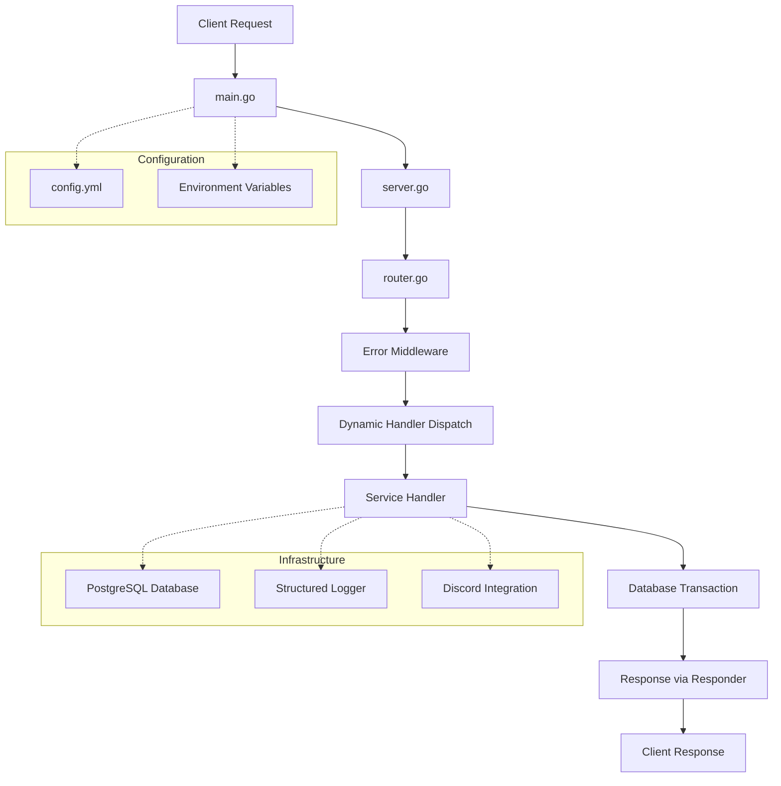

# 🚀 Godin

> A powerful Go backend service with service-oriented architecture, featuring dynamic handler dispatch and PostgreSQL integration for scalable CDN-like resource management.

[](https://golang.org/)

## ✨ Features

- 🏗️ **Service-Oriented Architecture** - Dynamic handler dispatch with pluggable service modules
- 🔐 **Robust API Design** - RESTful endpoints with comprehensive error handling middleware
- 📁 **CDN Pattern** - Standardized interfaces for file, session, and service management
- 🗄️ **PostgreSQL Integration** - Custom database abstraction with transaction support
- ⚙️ **Configuration Management** - Viper-based config with environment variable support and validation
- 📊 **Structured Logging** - Comprehensive logging with `go.uber.org/zap`
- 🎮 **Discord Integration** - Built-in Discord API integration for service interactions
- 🔧 **Modular Services** - Easy service registration following the `cdn.Handler` interface

## 🏗️ Architecture

Godin follows a service-oriented architecture with dynamic handler dispatch. The system is designed around the CDN pattern where services implement standardized interfaces for file, session, and service management operations.

### Route Structure
```
/v1/{resourceType}/{serviceName}/...
```
- `resourceType`: service, session, file  
- `serviceName`: Currently supports "eris" (extensible for additional services)

### Handler Interface
All services implement the `cdn.Handler` interface combining three core interfaces:
```go
type Handler interface {
    Service   // CreateService, GetService, DeleteService
    File      // CreateFile, GetFile, DeleteFile  
    Session   // CreateSession, GetSession, DeleteSession
}
```

### Request Flow

1. Router parses URL path to extract resource type and service name
2. Dispatches to appropriate handler method based on HTTP method  
3. Handler executes business logic with database transactions
4. Error handling via middleware wrapper provides consistent responses



## 🚀 Quick Start

### Prerequisites

- Go 1.24.3 or newer
- PostgreSQL database
- Optional: Discord bot token for Discord integration

### Installation

1. **Clone the repository**
   ```bash
   git clone <repository-url>
   cd Godin
   ```

2. **Install dependencies**
   ```bash
   go mod download
   ```

3. **Set up configuration**
   Create a `config/config.yml` file with your PostgreSQL connection details and other settings.

4. **Environment variables (optional)**
   Set environment variables prefixed with `GODIN_` (e.g., `GODIN_POSTGRES_CONNECTION_STRING`)

5. **Run the application**
   ```bash
   go run cmd/godin/main.go
   # or build first
   go build -o bin/godin cmd/godin/main.go
   ./bin/godin
   ```

## 📚 API Reference

The API follows the pattern `/v1/{resourceType}/{serviceName}/...` where:
- `resourceType`: `service`, `session`, or `file`
- `serviceName`: Currently supports `eris`

### Service Operations

#### `POST /v1/service/eris/`
Create a new service instance and initialize Discord guild with channels and webhooks.

**Request Body:**
```json
{
  "bot_token": "string",
  "guild_id": 123456789,
  "guild_channel_count": 5,
  "guild_webhook_count": 10
}
```

**Response (201 Created):**
```json
{
  "service_id": "uuid-string"
}
```

#### `GET /v1/service/eris/` *(Placeholder)*
Retrieve service information.

#### `DELETE /v1/service/eris/` *(Placeholder)*
Delete service instance.

### Session Operations

#### `POST /v1/session/eris/{service_id}/`
Create a new upload session for chunked file uploads.

**Request Body:**
```json
{
  "file_name": "example.txt"
}
```

**Response (201 Created):**
```json
{
  "session_id": "uuid-string",
  "max_upload_size": 52428800,
  "expires": 1693939200
}
```

#### `GET /v1/session/eris/{service_id}/` *(Placeholder)*
Retrieve session information.

#### `DELETE /v1/session/eris/{service_id}/` *(Placeholder)*
Delete session.

### File Operations

#### `POST /v1/file/eris/{session_id}/`
Upload file chunks via Discord webhooks. Processes binary file data in chunks based on Discord guild upload limits.

**Request Body:** Binary file data

**Response:** Success/error status

#### `PUT /v1/file/eris/{session_id}/` *(Placeholder)*
Complete file upload process.

#### `GET /v1/file/eris/{session_id}/` *(Placeholder)*
Download/retrieve file content.

#### `DELETE /v1/file/eris/{session_id}/` *(Placeholder)*
Delete file.

## 🔧 Development

### Project Structure

```
Godin/
├── cmd/
│   └── godin/           # Main application entry point
├── config/              # Application configuration files
├── internal/
│   ├── api/             # API handlers, router, and middleware
│   │   ├── handler/
│   │   │   └── eris/    # Eris service handler implementation
│   │   ├── middleware/  # Auth and error handling middleware
│   │   └── router.go    # Route dispatch and handler registration
│   ├── cdn/             # CDN service interface definitions
│   ├── config/          # Configuration loading and validation
│   ├── database/        # PostgreSQL abstraction with transactions
│   ├── discord/         # Discord API integration
│   ├── logger/          # Structured logging setup
│   └── server/          # HTTP server lifecycle management
└── pkg/
    ├── jsonutil/        # JSON utility functions
    ├── responder/       # Standardized API responses
    └── splitutil/       # URL parsing utilities
```

### Key Dependencies

- **HTTP Router**: Standard library `net/http` with `ServeMux`
- **Database**: PostgreSQL with `github.com/lib/pq` driver  
- **Configuration**: `github.com/spf13/viper` for config management
- **Logging**: `go.uber.org/zap` for structured logging
- **Discord API**: `github.com/bwmarrin/discordgo` for Discord integration
- **UUID**: `github.com/google/uuid` for service ID generation
- **Environment**: `github.com/subosito/gotenv` for .env file support

### Development Commands

```bash
# Build the application
go build -o bin/godin cmd/godin/main.go

# Run the application directly  
go run cmd/godin/main.go

# Install dependencies
go mod download

# Update dependencies
go mod tidy
```

### Running Tests

```bash
# Run all tests
go test ./...

# Run tests with coverage
go test -cover ./...

# Run tests with verbose output
go test -v ./...

# Run tests for specific package
go test -v ./internal/api/...
```

### Configuration

- **Primary Config**: `config/config.yml` (YAML format)
- **Environment Variables**: Prefixed with `GODIN_` (e.g., `GODIN_POSTGRES_CONNECTION_STRING`)
- **Dotenv Support**: Loads `.env` files automatically
- **Validation**: Built-in validation for required fields and formats
- **Default Server**: `127.0.0.1:60000` (configurable via `server_address`)
- **Development Mode**: Enable via `development: true` in config.yml

#### Configuration Structure
```yaml
# config/config.yml
development: true
server_address: "127.0.0.1:60000"
postgres_connection_string: "your-postgres-connection-string"
```

### Adding New Services

To add a new service, implement the `cdn.Handler` interface and register it in `internal/api/router.go:NewRouter()`:

```go
services := map[string]cdn.Handler{
    "eris": eris.NewHandler(log, db),
    "newservice": newservice.NewHandler(log, db), // Add here
}
```

## 🤝 Contributing

1. Fork the repository
2. Create your feature branch (`git checkout -b feature/amazing-feature`)
3. Commit your changes (`git commit -m 'Add some amazing feature'`)
4. Push to the branch (`git push origin feature/amazing-feature`)
5. Open a Pull Request

## 🆘 Support

- 🐛 **Issue Tracker** – Create issues for bugs and feature requests.
- 💬 **Discussions** – Join the GitHub Discussions board for questions and ideas.

---

<div align="center">
  <strong>Built with ❤️ and Go</strong>
</div>
